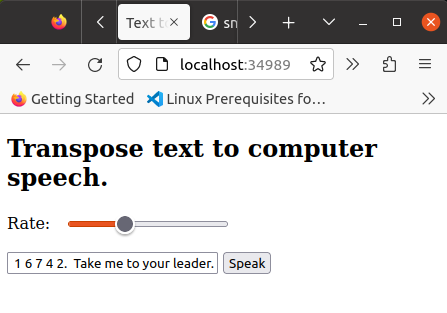

# Text-to-Speech App

A client web application developed with Parcel (a development build server).  The speech pattern should resemble how the speech synthesizer used by the physicist Steven Hawkins would sound.

Ref: [parcel](https://parceljs.org/getting-started/webapp/)


## Getting started

* Scalfolding:

```script
npm init -y
npm install --save-dev parcel
```

* Create the following files:

1.  `src/index.html`

2.  `src/style.css`

3.  `src/script.js`

## Run

The `parcel build` command bundles and optimizes your application for production.  It creates a default `dist` folder, then outputs neccessary code to run your application in it.  By default, minification, and tree shaking and scope hoisting are enabled when using the parcel build command. It is a good idea to remove the `dist`, and `parcel-cache` folders before re-building for production.  [Read more](https://parceljs.org/features/production/)


```script
npm run build


✨ Built in 2.99s

dist/index.html            676 B    1.15s
dist/index.0a8ea8c3.css    159 B    496ms
dist/index.6a6eaf2f.js     524 B    805ms
```

The `parcel` command runs the development server.

```script
npm run start

Server running at http://localhost:1234
✨ Built in 1.11s
```

## Navigate to `http://localhost:1234`



## Run Demo


## Have your own copy on local machine

You can download this code to your machine and open the index.html file in your web browser.  [download](https://github.com/hurricanemark/text-to-speech-demo/archive/refs/tags/Beta.v0.1.0.zip).  Edit `index.html` file to further customize it for yourself.   

